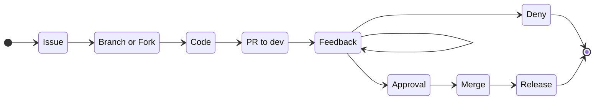
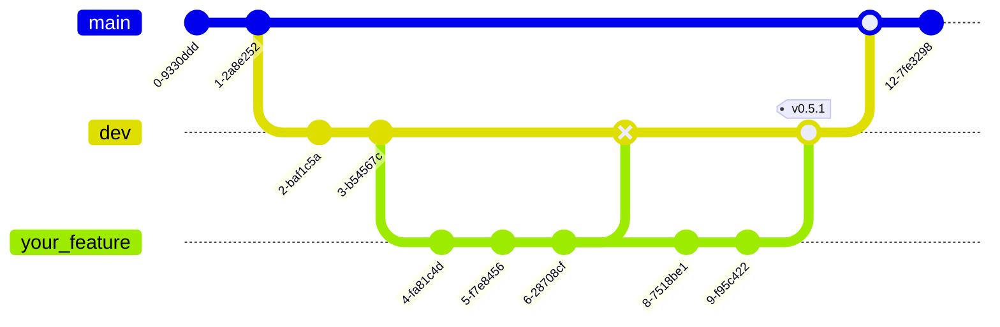

# Contributing

When contributing always follow this pipeline.



## Branching



## Commits

Commits messages should always be descriptive. Meaning technical descriptions without personal believes or feelings. Commits should always include any of these prefixes:

| Prefix              | Use case                                                     |
| ------------------- | ------------------------------------------------------------ |
| `docs:`             | The commit includes documentation update.                    |
| `feat:`             | The commit includes new features to the project.             |
| `fix:`              | The commit includes fixes for existing bugs.                 |
| `[skip ci] PREFIX:` | Reserved for CI/CD pipelines. Should never be used by a human. |

Commits should only contain changes related to the prefix used, for example: Never commit `feat` files with `docs` files.

Commit examples:

```
fix: fixed login UI by adding username and password inputs
```

```
docs: Documentation for deploying the SQL database
```

A recommendation is to search for the already existing commits in a repository.

## Issues

For issues names follow the same instructions of the [Commits](#Commits) section.

Describing issues should follow the issue template for each repository

## Pull Requests

For PR names follow the same instructions of the [Commits](#Commits) section.

- PR should always be created with existing Opened issues.
- PR description should point all the changes made by the devs.

## REST APIs

While developing REST API make sure you always create a `docs/spec.openapi.yaml` document in the repository assigned. Follow this link for more documentation about the [spec](https://swagger.io/specification/).