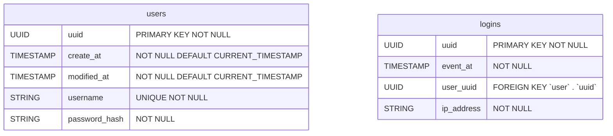
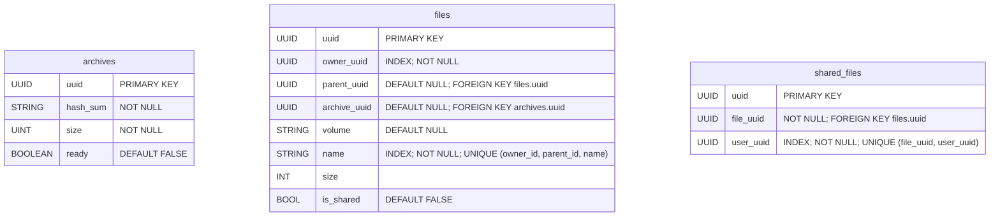
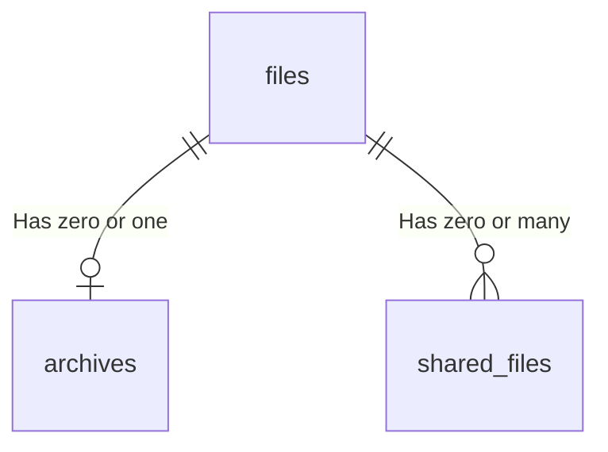

# Database

This document contains the models present in the database.

## Authentication

### Tables



### Relations


### Queries

#### Create user

```sql
INSERT INTO users (uuid, username, password_hash) 
VALUES (?, ?, ?)
```

#### Authenticate

```sql
SELECT uuid
FROM users
WHERE 
	Username     = ?
	AND password = ?
LIMIT 1

-- - Then if result UUID is not null

INSERT INTO logins (uuid, event_at, user_uuid, ip_address) VALUES (?, ?, ?, ?)
```

#### Update password

```sql
UPDATE users
SET
	modified_at   = NOW()
	password_hash = ?
WHERE
	uuid              = ?
	AND password_hash = ?
```

## Metadata

### Tables



#### Tables description

|      Name      | Description                                                  |
| :------------: | :----------------------------------------------------------- |
|    `files`     | This table contains metadata about the files and directories of the users. Note that, as in the UNIX file system, directories are also a type of file. **Make sure to include an `ON DELETE CASCADE` |
|   `archive`    | This table contains metadata about the archives (Actual files stored in the storage system). |
| `shared_files` | This table is used as main point for checking if a file has being shared with an specific account. |

#### Relations



#### Design notes

- If the `files.parent_uuid` value is `NULL`, then the file is in the user's root directory.
- If the `files.archive_uuid` value is `NULL`, then the file is a directory.
- If the `files.volume` value is `NULL`, then the file wasn't stored yet. 
- It's not necessary to store the `files.backup_volume` value because it can be inferred from the `files.volume` value, E.g. if the `files.volume` value is `volume_1`, then the `files.backup_volume` value is `volume_1_backup`.
- The `files.name` value needs to have a 3-tuple unique constraint so that the same **user** can't have two files with the same **name** in the same **directory**.

### Queries

#### Create directory

```sql
INSERT OR IGNORE INTO files(owner_uuid, parent_uuid, name)
VALUES(?, ?, ?)
```

#### Create file

First, create the `archive` metadata: 

```sql
INSERT OR IGNORE INTO archives(hash_sum, size)
VALUES(?, ?)
```

Then, create the `file` metadata:

```sql
INSERT OR IGNORE INTO files(owner_uuid, parent_uuid, archive_uuid, name)
VALUES(?, ?, ?, ?)
```

Note that the `archives.ready` value is set to `FALSE` by default and the `files.volume` value is set to `NULL` by default because the file wasn't stored at this point.

#### Mark as ready

First, update the `archive` metadata:

```sql
UPDATE archives
SET
	ready = TRUE
WHERE
	uuid = ?
```

Then, update the `file` metadata:

```sql
UPDATE files
SET
	volume = ?
WHERE
	archive_uuid = ?
```

#### Delete file

First, delete the `archive` metadata. Note that, if the file is a directory, then the `archive_uuid` value is `NULL`, so the `DELETE` query should not delete anything:

```sql
DELETE FROM archives
WHERE 
	archives.uuid = (
		SELECT archive_uuid
		FROM files
		WHERE
			files.uuid = ?
	)
```

Then, delete the `file` metadata:

```sql
DELETE FROM files
WHERE
	files.uuid = ?
```

#### List directory

```sql
SELECT uuid, name, archive_uuid, size, is_shared 
FROM files
WHERE
	owner_uuid  = ?
	AND parent_uuid = ?
LIMIT ? OFFSET (? - 1)
```

#### Get file UUID

```sql
SELECT uuid
FROM files
WHERE
	owner_uuid	 	= ?
	AND name   		= ?
```

### Share/Unshare a file

```sql
-- - This query should receive owner_uuid, other_user_uuid, file_to_share_uuid
-- - First check if session user is owner of the file
SELECT uuid
FROM files
WHERE
	owner_uuid = ?
LIMIT 1

-- - SHARE
-- - Then insert the file if we are the owners
INSERT INTO shared_files (uuid, file_uuid, user_uuid)
VALUES (?, ?, ?)

-- - UNSHARE
-- - Then insert the file if we are the owners
DELETE FROM shared_files
WHERE (
    file_uuid = ?
    AND user_uuid = ?
)
```

### Can I read

```pgsql
CREATE OR REPLACE FUNCTION can_read(file_uuid UUID, user_uuid UUID)
	RETURNS BOOLEAN 
	LANGUAGE PLPGSQL
	AS $$
DECLARE
	parent_uuid UUID;
	is_owner BOOLEAN;
	is_shared BOOLEAN;
BEGIN
	-- Check if the user is the owner of the file
	SELECT COUNT(uuid) > 0
	INTO is_owner
	FROM files
	WHERE
		files.uuid = file_uuid
		AND files.owner_uuid = user_uuid;
	
	IF is_owner THEN
		RETURN TRUE;
	END IF;

	-- Check if the file was directly shared with the user
	SELECT COUNT(uuid) > 0
	INTO is_shared
	FROM shared_files
	WHERE
		shared_files.file_uuid = file_uuid
		AND shared_files.user_uuid = user_uuid; 

	IF is_shared THEN
		RETURN TRUE;
	END IF;

	-- Check if the file is contained in a directory shared with the user
	SELECT files.parent_uuid
	INTO parent_uuid
	FROM files
	WHERE
		files.uuid = file_uuid; 
	
	IF parent_uuid IS NULL THEN
		RETURN FALSE;
	ELSE
		RETURN can_read(parent_uuid, user_uuid);
	END IF;
END $$
; 
```

### Files shared with me

```sql
-- - This query receives the UUID of the current session
SELECT (files.uuid, files.name, files.owner_uuid, file.size)
FROM files, shared_files
WHERE
	shared_files.user_uuid = ?
	AND files.uuid = ?
	AND files.UUID = shared_files.file_uuid
```

### File shared with who

```sql
-- - Query used by file owner to list other users that have access to file
-- - Receives the owner_uuid and the file_uuid
SELECT (shared_files.user_uuid)
FROM files, shared_files
WHERE
	files.uuid = ?
	AND owner_uuid = ?
	AND files.uuid = shared_files.uuid
```

## Worker

### Structure

```
/
├── files/
│   ├── [VOLUME_MOUNT_DATA_1]/
│   │   └── [FILE_UUID_X]
│   └── [VOLUME_MOUNT_DATA_2]/
│       └── [FILE_UUID_Y]
└── backups/
    ├── [VOLUME_MOUNT_BACKUP_1]/
    │   └── [FILE_UUID_X]
    └── [VOLUME_MOUNT_BACKUP_2]/
        └── [FILE_UUID_Y]
```

|   Path    |                         Description                          |
| :-------: | :----------------------------------------------------------: |
|  `files`  | This directory is a volume mounted on the pod. Used as main file storage point |
| `backups` | In this directory are mounted other volumes used as backup points |