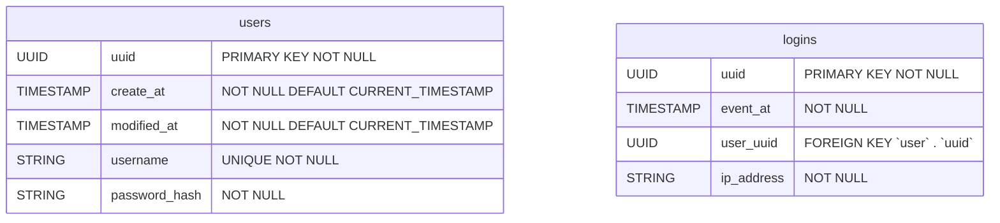
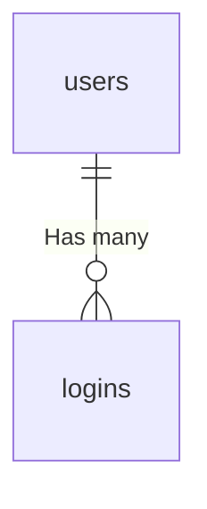
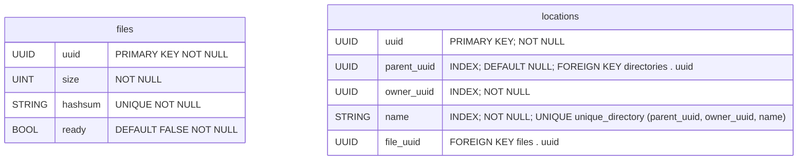
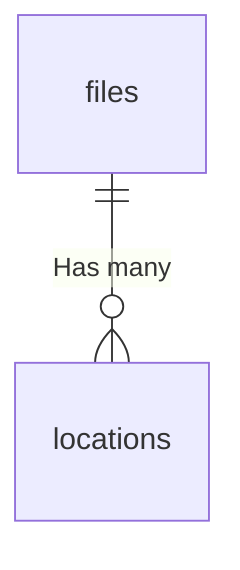

# Database

This document contains the models present in the database.

## Authentication

### Tables



### Relations



### Queries

#### Create user

```sql
INSERT INTO users (uuid, username, password_hash) 
VALUES (?, ?, ?)
```

#### Authenticate

```sql
SELECT uuid
FROM users
WHERE 
	Username     = ?
	AND password = ?
LIMIT 1

-- - Then if result UUID is not null

INSERT INTO logins (uuid, event_at, user_uuid, ip_address) VALUES (?, ?, ?, ?)
```

#### Update password

```sql
UPDATE users
SET
	modified_at   = NOW()
	password_hash = ?
WHERE
	uuid              = ?
	AND password_hash = ?
```

## Metadata

### Tables



### Relations



### Queries

#### Create directory

```sql
INSERT INTO locations (uuid, parent_uuid, owner_uuid, name)
VALUES (?, ?, ?, ?)
```

#### Create file

```sql
INSERT OR IGNORE INTO files (uuid, size, hashsum, ready)
VALUES (?, ?, ?, FALSE)

-- - Then create the location

INSERT INTO locations (uuid, parent_uuid, owner_uuid, name, file_uuid)
VALUES (?, ?, ?, ?, ?)
```

#### Delete file / directory

```sql
DELETE FROM files
WHERE
	owner_uuid = ?
	AND uuid   = ?
```

#### List directory

```sql
SELECT uuid, name, file_uuid
FROM locations
WHERE
	owner_uuid      = ?
	AND parent_uuid = ?
LIMIT ? OFFSET (? - 1)
```

#### Get file UUID

```sql
SELECT uuid
FROM locations
WHERE
	uuid           = ?
	AND owner_uuid = ? 
LIMIT 1
```

#### Make ready

```sql
UPDATE files
SET ready = TRUE
WHERE uuid = ?
```

## Worker

### Structure

```
/
├── files:[VOLUME_MOUNT_DATA]/
│   ├── [FILE_UUID_X]
│   └── [FILE_UUID_Y]
└── backups/
    ├── [VOLUME_MOUNT_BACKUP_1]/
    │   ├── [FILE_UUID_X]
    │   └── [FILE_UUID_Y]
    └── [VOLUME_MOUNT_BACKUP_2]/
        ├── [FILE_UUID_X]
        └── [FILE_UUID_Y]
```

|   Path    |                         Description                          |
| :-------: | :----------------------------------------------------------: |
|  `files`  | This directory is a volume mounted on the pod. Used as main file storage point |
| `backups` | In this directory are mounted other volumes used as backup points |