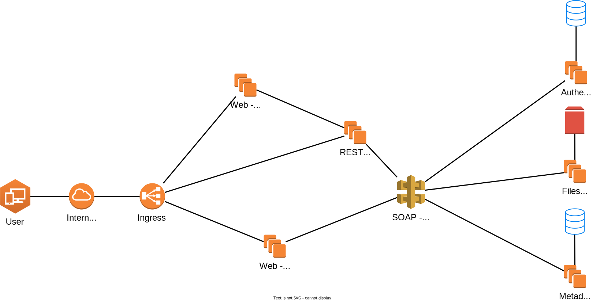

# docs

This repository describes the entire project documentation. And should be used as main entry point to new developers.

## Index

| Documentation | Location                        |
| ------------- | ------------------------------- |
| Contributing  | [CONTRIBUTING](CONTRIBUTING.md) |
| CI/CD         | [CICD](CICD.md)                 |
| Use cases     | [Use cases](Use%20cases.md)     |
| Database      | [Database](Database.md)         |

## Architecture

