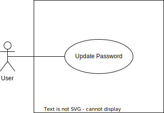

# Use cases

This document describes the functionalities of the entire application.

## Authentication

|  Documentation  |                             URL                              |
| :-------------: | :----------------------------------------------------------: |
|   Repository    | [authentication-go](https://github.com/hawks-atlanta/authentication-go) |
| Database Models |             [Models](Database.md#Authentication)             |
|     OpenAPI     | [Specification](https://github.com/hawks-atlanta/authentication-go/docs/spec.openapi.yaml) |

### Authorization

### Account

## Metadata

|  Documentation  |                             URL                              |
| :-------------: | :----------------------------------------------------------: |
|   Repository    | [metadata-scala](https://github.com/hawks-atlanta/metadata-scala) |
| Database Models |                [Models](Database.md#Metadata)                |
|      Logic      |                   [docs](docs/Metadata.md)                   |
|     OpenAPI     | [Specification](https://github.com/hawks-atlanta/metadata-scala/docs/spec.openapi.yaml) |

### Files index

### Worker uploads

## Worker

|  Documentation  |                             URL                             |
| :-------------: | :---------------------------------------------------------: |
|   Repository    | [worker-java](https://github.com/hawks-atlanta/worker-java) |
| Database Models |                [Models](Database.md#Worker)                 |
|      Logic      |                   [docs](docs/Worker.md)                    |

### Filesystem

### Gateway

The gateway by itself is a proxy that manages the access to the rest of the microservices running in the cluster. So its functionality is the **UNION** of all **Use cases** mentioned before plus the combination of the AUTH check.

Read [Gateway.md](docs/Gateway.md) for more information.
