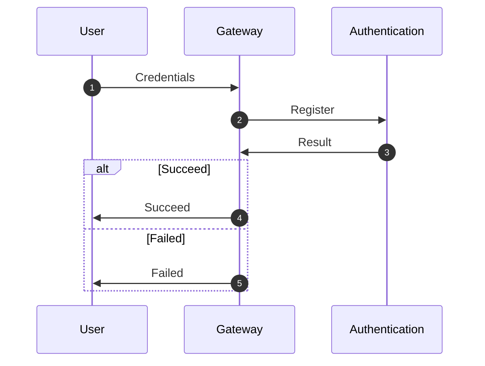
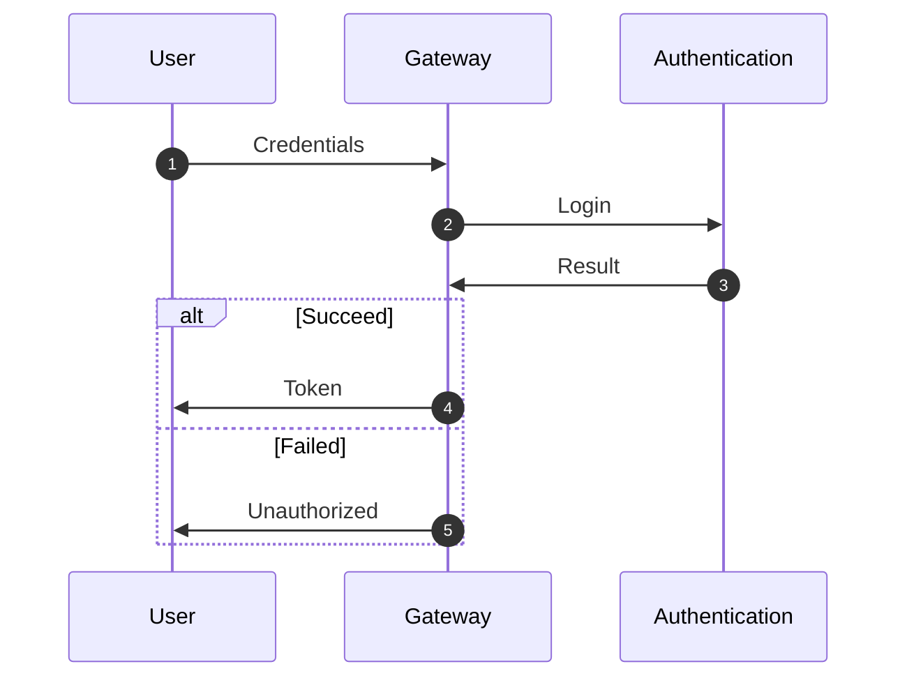
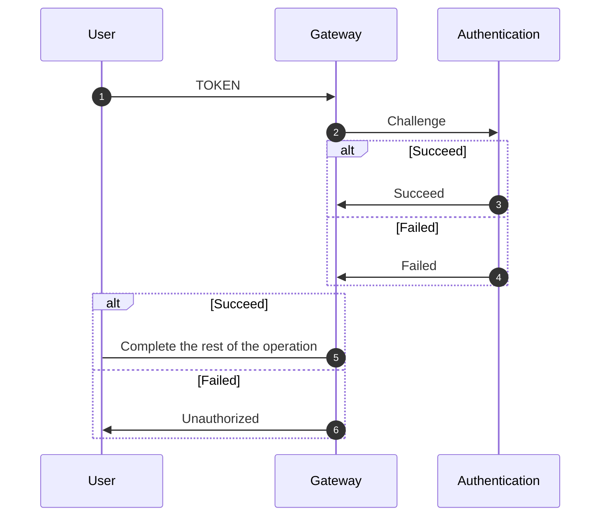
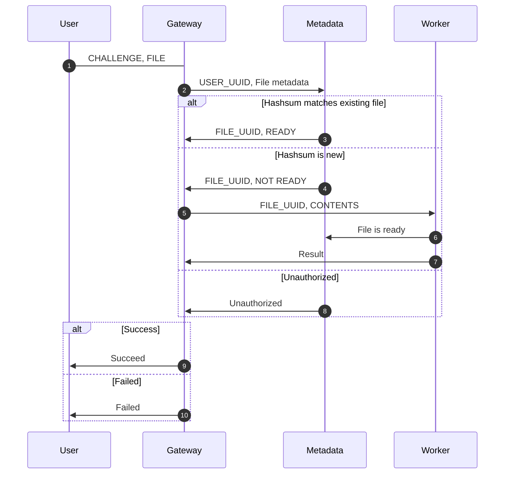
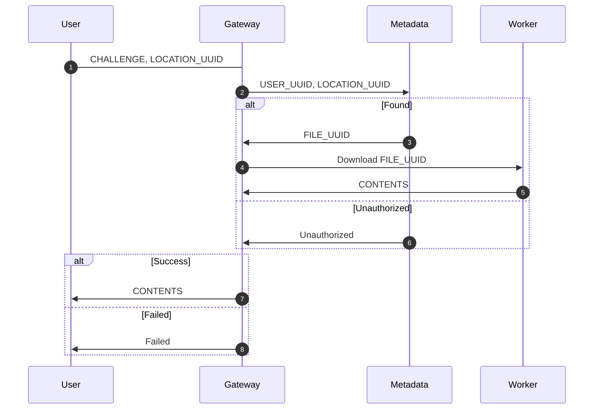
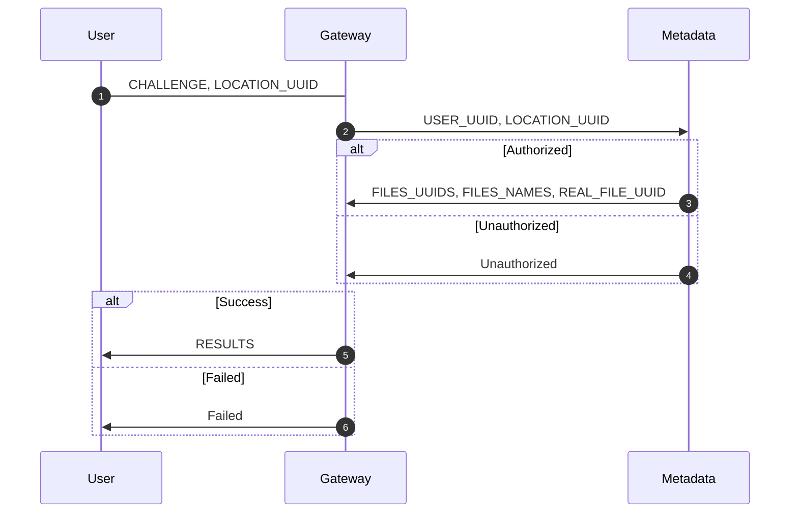

## Gateway

This document describe the internal logic behind the gateway.

## Register

```mermaid
sequenceDiagram
	autonumber
	User           ->> Gateway:        Credentials
	Gateway        ->> Authentication: Register
	
	Authentication ->> Gateway: Result
	
	alt Succeed
		Gateway ->> User: Succeed
	else Failed
		Gateway ->> User: Failed
	end
```

## Login

```mermaid
sequenceDiagram
	autonumber
	User           ->> Gateway:        Credentials
	Gateway        ->> Authentication: Login
	
	Authentication ->> Gateway: Result
	
	alt Succeed
		Gateway ->> User: Token
	else Failed
		Gateway ->> User: Unauthorized
	end
```

### Challenge

```mermaid
sequenceDiagram
	autonumber
	User           ->> Gateway:        TOKEN
	Gateway        ->> Authentication: Challenge
	
	alt Succeed
		Authentication ->> Gateway: Succeed
	else Failed
		Authentication ->> Gateway: Failed
	end
	
	alt Succeed
		Gateway -> User: Complete the rest of the operation
	else Failed
		Gateway ->> User: Unauthorized
	end
```

## Upload

```mermaid
sequenceDiagram
	autonumber
	User    -> Gateway: CHALLENGE, FILE
	
	Gateway ->> Metadata: USER_UUID, File metadata
	alt Hashsum matches existing file
		Metadata ->> Gateway: FILE_UUID, READY
    else Hashsum is new
    	Metadata ->> Gateway:  FILE_UUID, NOT READY
        Gateway  ->> Worker:   FILE_UUID, CONTENTS
        Worker   ->> Metadata: File is ready
        Worker   ->> Gateway:  Result
    else Unauthorized
    	Metadata ->> Gateway: Unauthorized
    end
    
    alt Success
    	Gateway ->> User: Succeed
    else Failed
    	Gateway ->> User: Failed
    end
```

## Download

```mermaid
sequenceDiagram
	autonumber
	User    -> Gateway: CHALLENGE, LOCATION_UUID
	
	Gateway ->> Metadata: USER_UUID, LOCATION_UUID
	alt Found
		Metadata ->> Gateway: FILE_UUID
		Gateway  ->> Worker:  Download FILE_UUID
		Worker   ->> Gateway: CONTENTS
    else Unauthorized
    	Metadata ->> Gateway: Unauthorized
    end
    
    alt Success
    	Gateway ->> User: CONTENTS
    else Failed
    	Gateway ->> User: Failed
    end
```

## List directory contents

```mermaid
sequenceDiagram
	autonumber
	User    -> Gateway: CHALLENGE, LOCATION_UUID
	
	Gateway ->> Metadata: USER_UUID, LOCATION_UUID
	alt Authorized
		Metadata ->> Gateway: FILES_UUIDS, FILES_NAMES, REAL_FILE_UUID
    else Unauthorized
    	Metadata ->> Gateway: Unauthorized
    end
    
    alt Success
    	Gateway ->> User: RESULTS
    else Failed
    	Gateway ->> User: Failed
    end
```

