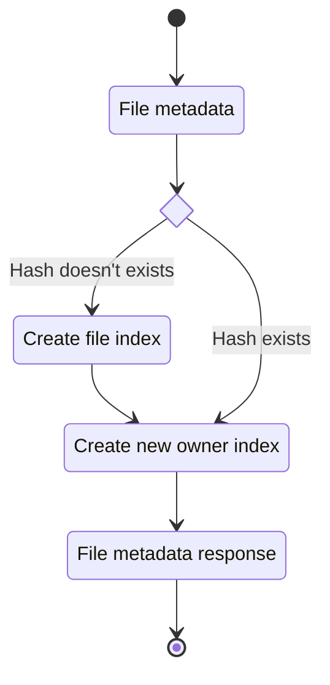

## Metadata

## Create file

```mermaid
stateDiagram-v2
    state exists <<choice>>
    
    request: File metadata
    file_index: Create file index
    owner_index: Create new owner index
    response: File metadata response
    
    [*] --> request
    request --> exists
    exists --> file_index: Hash doesn't exists
    file_index --> owner_index
    exists --> owner_index: Hash exists
    owner_index --> response
    response --> [*]
```
